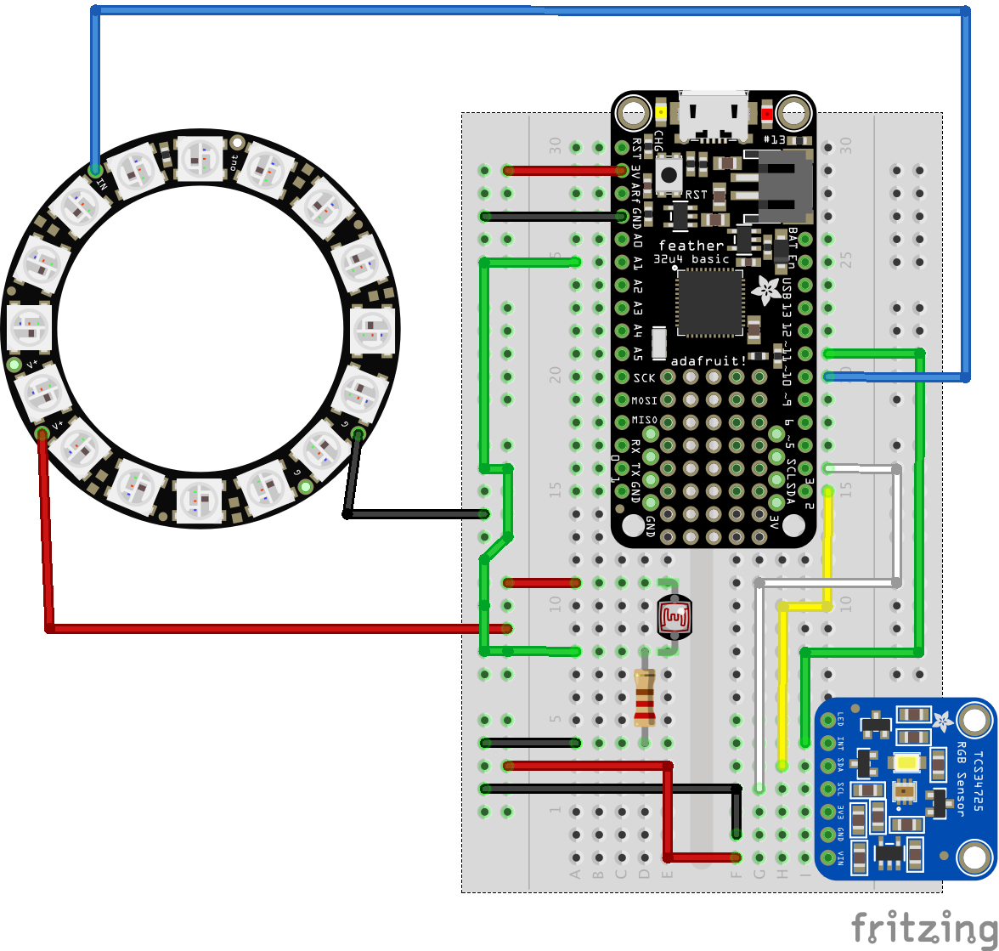

# ColorCube
A fun project that uses an Adafruit TCS34725 RGB color sensor and NeoPixel ring to create a color sensing lamp.

# Hardware
* Adafruit Feather 32u4 Basic Proto
* Adafruit TCS34725 color sesnor
* NeoPixel 16 Pixel LED Ring
* 220 Ohm Resistor
  

# Overview
The TCS module returns 16-bit values for each color channel (red, green, blue, and clear). The firmware converts these values into 8-bit values for the NeoPixel ring to utilize. The conversion is based on a calibration step that occurs when the device is first powered up in an attempt to read colors with increased accurately. A photo-resistor is used to detect a shadow over the sensor so the device will know when to take a sample and change color.

At power up, the NeoPixel ring will begin to fill up with the color red, during this time place a brightly red object on top of the sensor until the circle of red is complete. Once all NeoPixels are red the TCS LED will flash and a sample of the red object will be taken. This is considered the "maximum" red value under the current lighting conditions and will be used to map colors later. The above process will be repeated for green and blue as well. When calibration is complete all the NeoPixels will be white.

The photo-resistor should be placed very closely to the sensor module. When a sufficiently large object is placed over the photo-resistor + sensor combination the shadow will be detected and a color sample will be taken (the sensor LED will flash).

#### Tips
* Place the object as close to sensor as possible.
* Re-calibrate when lighting conditions change to increase result accuracy.

#### Improvements
* The color accuracy can be improved. At times greens will be mistaken for blue and non primary colors are not accurately shown on the NeoPixels.
* Create an enclosure with fogged glass that can diffuse the light. Also, firmly place sensor and photo-resistor together.
* Add a reset button so calibration can be done without removing any part of the enclosure.
